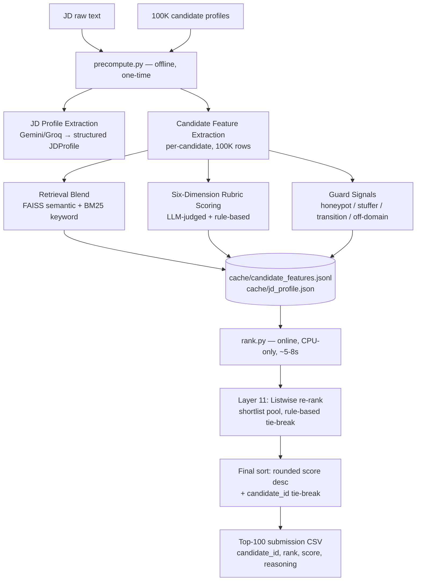

# PRISM — Proof driven Ranking and Intelligent Selection Model

**A multi-layer, evidence-backed hiring pipeline that ranks 100,000 candidates against a job description — and proves its rankings aren't just keyword matching.**

Built for the **Redrob AI India Runs Data and AI Challenge**.

> [!NOTE]
> <!-- TODO: one-line pitch, e.g. "PRISM scores candidates the way a senior recruiter would — combining retrieval, LLM reasoning, and fraud-detection guards, not just keyword overlap." -->

---

## Table of Contents

- [Why PRISM](#why-prism)
- [Headline Result](#headline-result)
- [Architecture](#architecture)
- [The Six-Dimension Rubric](#the-six-dimension-rubric)
- [Guard Layers (Anti-Gaming)](#guard-layers-anti-gaming)
- [Tech Stack](#tech-stack)
- [Project Structure](#project-structure)
- [Setup](#setup)
- [Usage](#usage)
- [Evaluation & Ablation Study](#evaluation--ablation-study)
- [Robustness Testing](#robustness-testing)
- [Results Summary](#results-summary)
- [Team](#team)
- [License](#license)

---

## Why PRISM

Most hiring-ranker submissions for hackathons like this score candidates by keyword overlap with the JD — easy to game, and blind to actual domain fit. PRISM is built around a simple thesis: **a ranking pipeline is only trustworthy if you can show what happens when you strip each layer away.**

So instead of just shipping a ranked list, PRISM ships:
1. A ranking pipeline with 5 progressively richer scoring tiers
2. An **ablation study** that measures, layer by layer, what each tier actually changes about the top-100
3. **Guard mechanisms** that explicitly catch and demote keyword-stuffers, off-domain candidates, and undisclosed career transitions
4. **Robustness testing** — determinism checks, malformed-data injection, and a documented bug found-and-fixed during stress testing

---

## Headline Result

| Metric | Value | What it means |
|---|---|---|
| Jaccard overlap (keyword-only top-100 vs. full-pipeline top-100) | **0.0** | Zero candidates in common — the two approaches disagree completely |
| Kendall's tau (keyword-only score vs. full-pipeline rank) | **-0.753** | Strong, statistically robust *negative* correlation — not noise |

In other words: candidates that a naive keyword matcher would rank #1–10 are, on inspection, frequently keyword-stuffers with mismatched actual domain experience. PRISM's full pipeline demotes them by **28,000–42,000 ranks**.

```
Deepak Pandey (CAND_0000406) — DevOps Engineer, headline "Backend systems & APIs" → rank 42,193
Myra Sen      (CAND_0000703) — Mobile Developer, headline "Full-stack development" → rank 31,929
Deepak Mehta  (CAND_0000570) — DevOps Engineer, headline "Backend systems & APIs" → rank 28,804
```

All three had headlines dense with JD-matching buzzwords despite their actual titles sitting in a different domain. The full pipeline catches the mismatch; keyword matching does not.

---

## Architecture

PRISM is a **two-script design**, split deliberately so the expensive part (LLM calls) and the fast part (final ranking) never touch the same execution path:



**Why this split matters:** `rank.py` never makes a network call. Given a fixed precompute cache, it is fully deterministic and reproducible — verified by running it twice and diffing the output (see [Robustness Testing](#robustness-testing)).

### Pipeline stages in detail

| Stage | Script | What happens |
|---|---|---|
| JD parsing | `precompute.py` | Raw JD text → structured `JDProfile` (job_title, seniority, domain, required/preferred skills, hidden expectations, ambiguity flags) via Gemini/Groq |
| Candidate feature extraction | `precompute.py` | Per-candidate: keyword matches, retrieval scores, six rubric dimensions, guard signals — written once to `cache/candidate_features.jsonl` |
| Retrieval | `precompute.py` | FAISS (semantic similarity) blended with BM25 (keyword/lexical) — this is the "retrieval_blend" tier in the ablation study |
| Rubric scoring | `precompute.py` | Six weighted dimensions (below), producing `final_score` (0–100) |
| Guard checks | `precompute.py` | Honeypot risk, stuffer risk, self-disclosed transition multiplier, off-domain title detection |
| Listwise re-rank | `rank.py` (Layer 11) | Rule-based tie-break over a shortlist pool (default 300), using dimension scores + GitHub activity as tiebreakers |
| Submission ordering | `rank.py` | Final deterministic sort: rounded score desc, candidate_id asc on ties (validator-compliant) |
| Reasoning generation | `rank.py` | Fact-grounded, per-candidate explanation for each of the top 100 |
| Evaluation/Ablation | `ablation_report.py` (Layer 17) | Reconstructs 5 tiers from the *same* cache (no new LLM calls) to measure each layer's marginal contribution |

---

## The Six-Dimension Rubric

Each candidate's `final_score` is built from a weighted combination of:

| Dimension | Weight | What it captures |
|---|---|---|
| Skill fit | 0.30 | Overlap and depth of required/preferred skills |
| Experience depth | 0.20 | Years and seniority of relevant experience |
| Seniority match | 0.15 | Alignment between candidate level and JD seniority |
| Domain match | 0.15 | Actual domain/industry alignment (not just title keywords) |
| Career growth | 0.10 | Trajectory — progression, not stagnation |
| Proof strength | 0.10 | Evidence quality (verifiable projects, GitHub activity, etc.) |

---

## Guard Layers (Anti-Gaming)

PRISM explicitly detects and demotes three failure modes that keyword-matching is blind to:

- **Stuffer risk** — headlines/profiles dense with JD keywords but with weak actual evidence
- **Honeypot risk** — <!-- TODO: describe what this guard specifically detects -->
- **Self-disclosed transition multiplier** — penalizes/flags candidates mid-career-transition where claimed fit may not reflect actual readiness
- **Off-domain title detection** — regex/rule-based check (e.g. flags `Backend|Analytics|Data Engineer` titles against the JD's actual domain)

The [ablation study](#evaluation--ablation-study) below is the direct proof these guards work — without them, **54–55 off-domain candidates and 90–91 self-disclosed transitions** would appear in the top-100. With guards active, both numbers go to **zero**.

---

## Tech Stack

- **LLM reasoning:** Gemini, Groq
- **Retrieval:** FAISS (semantic), BM25 (keyword)
- **Validation/schemas:** Pydantic
- **Dashboard:** Streamlit
- **Language:** Python

---

---

## Setup

```powershell
# TODO: confirm exact dependency install step
pip install -r requirements.txt

# TODO: list required environment variables (API keys etc.)
# e.g. GEMINI_API_KEY=...
# e.g. GROQ_API_KEY=...
```

---

## Usage

**1. Precompute (offline, run once per JD + candidate pool):**

```powershell
python precompute.py --jd data/hackathon/jd.txt --candidates candidates.jsonl --cache-dir cache
```

**2. Rank (online, fast, deterministic):**

```powershell
python rank.py --jd data/hackathon/jd.txt --candidates candidates.jsonl --cache-dir cache --output docs/submission.csv
```

Runtime: ~5–8 seconds for 100,000 candidates → top 100, on CPU, no network calls.

**3. Run the ablation/evaluation report:**

```powershell
python ablation_report.py --cache-dir cache --output docs/ablation_report.json
```

---

## Evaluation & Ablation Study

To isolate what each pipeline stage actually contributes, we reconstructed 5 progressively richer rankings from the *same* precompute cache — no new LLM calls — and measured each tier's top-100 composition (n = 100,000 candidates):

| Tier | Off-domain titles | Self-disclosed transitions | Avg. stuffer risk |
|---|---|---|---|
| Keyword-only | 0 | 0 | 0.050 |
| + Skill graph | 10 | 17 | 0.042 |
| + Agent rubric | 54 | 90 | 0.007 |
| + Retrieval blend | 55 | 91 | 0.007 |
| + Guards (full pipeline) | **0** | **0** | 0.024 |

**Reading this table:** keyword-only matching can't surface off-domain candidates at all — but it's the easiest to game (highest stuffer-risk). As richer signals are layered in, the ranker starts surfacing nominally well-matched but actually off-domain or recently-transitioned candidates. The final guard layer explicitly catches and removes these, collapsing both counts to zero while keeping stuffer-risk less than half the keyword-only baseline.

**This is direct, measurable evidence the guards are not cosmetic** — without them, roughly half of the top-100 would be wrong-fit candidates.

---

## Robustness Testing

Beyond accuracy, the pipeline was stress-tested for production-grade reliability:

**Determinism** — `rank.py` run twice against the identical JD + cache produced an **identical ranking order and identical top-100 set**, both times. Confirms the offline ranking stage is fully reproducible.

**Score sanity at scale** — all 100,000 cached `final_score` values checked for `NaN`/`None`/out-of-range values. **Zero anomalies.**

**Malformed-data injection** — four synthetic corrupted candidates (empty dimensions, empty skill matches, explicit `None` score, missing risk fields) were injected into the cache. The first run **crashed**:

```
TypeError: float() argument must be a string or a real number, not 'NoneType'
```

Root cause: a `.get(key, default)` pattern that only falls back when a key is *missing*, not when its value is explicitly `None`. Fixed with a null-safe coercion helper applied across all numeric reads in the ranking path. After the fix, the same corrupted cache (100,004 rows) ranked successfully in 6.1s, and **none of the 4 corrupted candidates appeared in the final top-100** — confirming the pipeline degrades gracefully on partial data corruption instead of crashing or silently promoting bad data.

---

## Results Summary

- Ranks **100,000** candidates against a single JD in **~5–8 seconds** (offline precompute excluded)
- **Zero overlap** with naive keyword-matching top-100; strong negative rank correlation (tau = -0.753)
- Guards demonstrably remove **all** off-domain and undisclosed-transition candidates from the top-100, where they'd otherwise make up over half the list
- Fully deterministic, validated at 100K-candidate scale, stress-tested against malformed input

---

## Team

<!-- TODO: confirm names/roles/links -->
- **Arushi Tripathi** —
- **Eishaan Khatri** ([@Eishaan-Khatri](https://github.com/Eishaan-Khatri)) —

---

## License

<!-- TODO: add license, e.g. MIT -->
